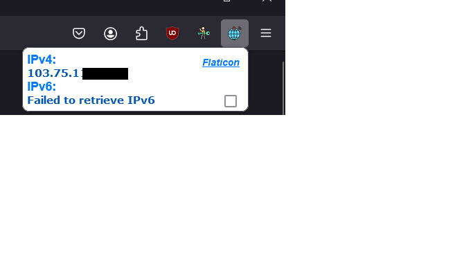

# SimpleIP
A browser extension that lets you view your network settings and connection status by displaying your IP address.

## 🚀 Features
Display your public IP address (IPv4, IPv6), connection status indicators, user-friendly interface, lightweight, dark mode support.

## 💡 Functionality 
The extension displays your IP and network details in a pop-up when you click the icon, using browser APIs. It updates in real-time and includes a dark mode toggle for easier reading.

## License
This project is licensed under the MIT License.

